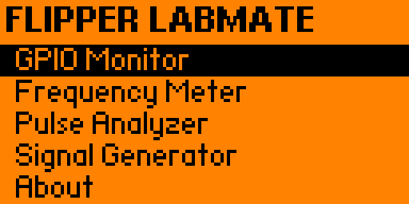
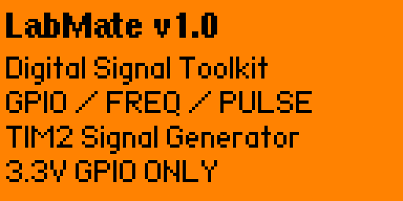
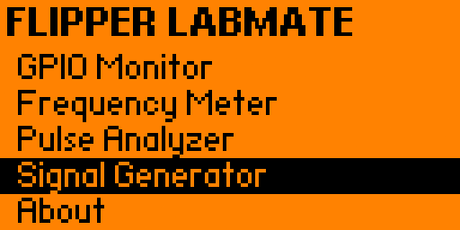
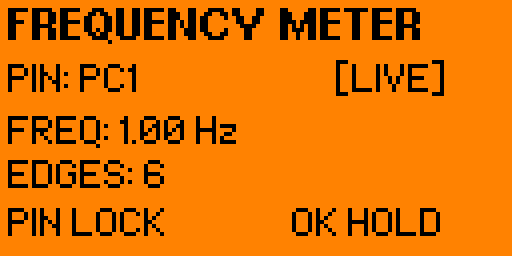
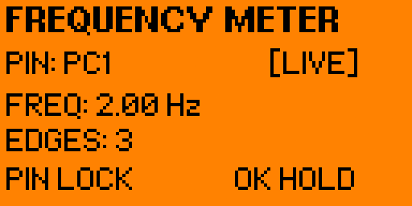
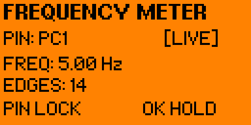
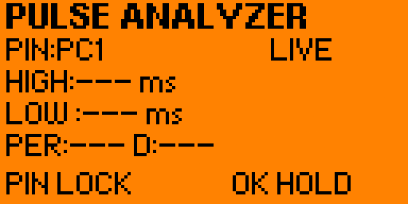
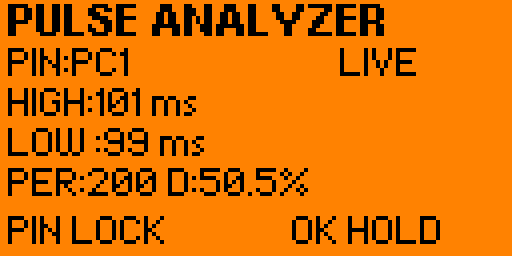
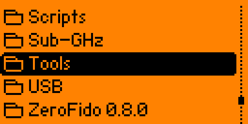

# Flipper LabMate

**LabMate v1.0** is a compact digital-signal diagnostic toolkit for Flipper Zero running Momentum Firmware.

It combines four practical tools in one external app:

- **GPIO Monitor** — view HIGH/LOW state and edge activity
- **Frequency Meter** — interrupt-based frequency measurement on PC1
- **Pulse Analyzer** — HIGH time, LOW time, period and duty cycle
- **Signal Generator** — hardware-timed 1 Hz / 2 Hz / 5 Hz square-wave output on PA7

> **3.3 V GPIO ONLY.** Do not connect 5 V, 12 V, automotive wiring, or unknown-voltage signals directly to Flipper Zero GPIO.

## Screenshots

### Main Interface

| Main Menu | About |
|---|---|
|  |  |

### GPIO Monitor & Signal Generator

| GPIO Monitor | Signal Generator |
|---|---|
|  |  |

### Frequency Meter

| 1 Hz | 2 Hz | 5 Hz |
|---|---|---|
|  |  |  |

### Pulse Analyzer

| Idle | Signal Measurement |
|---|---|
|  |  |

### Flipper Zero Menu

| Tools Menu | LabMate |
|---|---|
|  |  |

## Features

### GPIO Monitor

- Digital HIGH / LOW display
- Edge counter
- LIVE / HOLD modes
- Selectable external GPIO pins

### Frequency Meter

- Rising-edge GPIO interrupt capture
- High-resolution timing using `DWT->CYCCNT`
- Moving-period averaging
- Two-decimal frequency display
- Edge counter
- Signal-loss timeout
- Input intentionally locked to **PC1** in v1.0 for stability

### Pulse Analyzer

- HIGH duration
- LOW duration
- Period
- Duty cycle
- LIVE / HOLD modes

### Signal Generator

- Output pin: **PA7**
- TIM2 hardware-timer driven
- 50% duty cycle
- Presets: **1 Hz, 2 Hz, 5 Hz**
- Continues running while navigating back to the LabMate menu

## Verified Self-Test

For the built-in loopback test, connect:

```text
PA7 / physical pin 2  ->  PC1 / physical pin 15
```

Then start the Signal Generator and open Frequency Meter.

Verified results on the tested build:

| Generator | Frequency Meter |
|---:|---:|
| 1 Hz | 1.00 Hz |
| 2 Hz | 2.00 Hz |
| 5 Hz | 5.00 Hz |

The Pulse Analyzer was also verified with the same generated square-wave signal.

## Architecture

```text
Signal generation:
TIM2 -> PA7

Frequency measurement:
PC1 rising-edge IRQ -> DWT->CYCCNT -> period averaging -> frequency
```

## Installation

LabMate is an external Flipper Zero application.

The compiled application is installed as:

```text
/ext/apps/Tools/labmate.fap
```

On Flipper Zero it can be opened from:

```text
Apps -> Tools -> LabMate
```

## Build From Source

Place the LabMate files inside your Momentum Firmware tree:

```text
applications_user/labmate/
├── application.fam
├── labmate.c
└── labmate_10px.png
```

Build the application:

```powershell
.\fbt APPSRC=applications_user\labmate
```

Build, install and launch directly on a connected Flipper Zero:

```powershell
.\fbt launch APPSRC=applications_user\labmate
```

The generated FAP can be found under the firmware build directory:

```text
build\f7-firmware-C\.extapps\labmate.fap
```

## Controls

LabMate uses the standard Flipper Zero directional controls.

- **Up / Down** — navigate menu items or available options
- **Left / Right** — change selectable values where supported
- **OK** — select, start, stop or toggle an action
- **Back** — return to the previous screen
- **HOLD** — available in measurement tools where applicable

## Hardware Safety

Flipper Zero GPIO operates at **3.3 V logic levels**.

Do not directly connect:

- 5 V logic
- 12 V signals
- Automotive electrical lines
- Mains voltage
- Unknown-voltage sources

Use appropriate protection, level shifting, isolation or signal conditioning when measuring external circuits.

## Tested Platform

LabMate v1.0 was tested with:

- **Device:** Flipper Zero
- **Firmware:** Momentum Firmware
- **Firmware API:** 87.1
- **Application type:** External FAP

## v1.0 Stability Notes

The Signal Generator was moved from software/polling timing to the **TIM2 hardware timer**.

This produced stable loopback measurements:

- **1 Hz → 1.00 Hz**
- **2 Hz → 2.00 Hz**
- **5 Hz → 5.00 Hz**

Frequency measurement uses GPIO rising-edge interrupts together with the ARM DWT cycle counter.

Runtime Frequency Meter pin switching was intentionally disabled after testing showed instability when dynamically reconfiguring the GPIO interrupt on the tested Momentum build.

For this reason, Frequency Meter uses **PC1** in v1.0.

GPIO Monitor and Pulse Analyzer retain their selectable-pin behavior.

## Project Structure

```text
flipper-labmate/
├── application.fam
├── labmate.c
├── labmate_10px.png
├── screenshots/
├── docs/
├── CHANGELOG.md
├── RELEASE_NOTES_v1.0.md
├── LICENSE
└── README.md
```

## Status

**LabMate v1.0 — Stable**

Validated functionality:

- GPIO Monitor
- Frequency Meter
- Pulse Analyzer
- Signal Generator
- LIVE / HOLD behavior
- GPIO cleanup
- Frequency measurement stability
- Hardware-timer signal generation
- Application navigation

## Author

**sehma**

LabMate was developed as a portable GPIO and digital-signal diagnostic utility for Flipper Zero.

## License

This project is released under the **MIT License**.

See `LICENSE` for details.