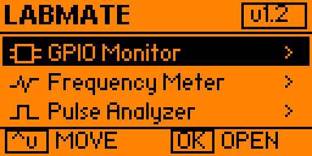
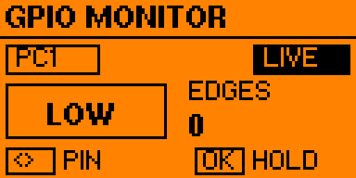
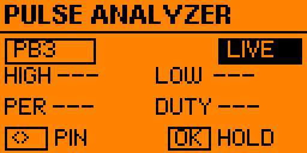
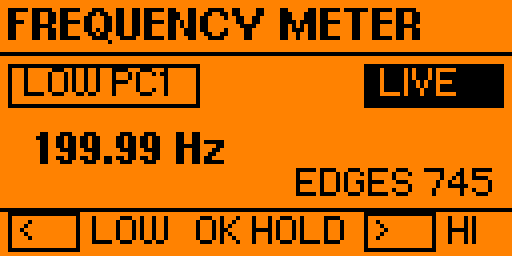
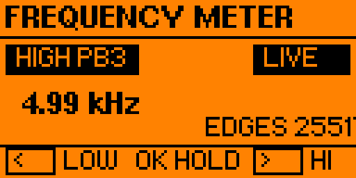
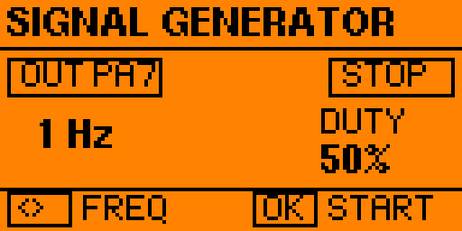
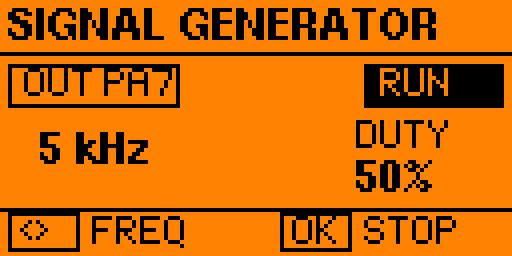
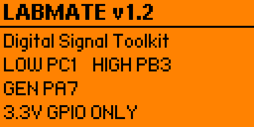

# Flipper LabMate

**LabMate v1.3** is a compact digital-signal diagnostic toolkit for Flipper Zero running Momentum Firmware.

It combines GPIO monitoring, low/high-frequency measurement, pulse analysis, and hardware-PWM signal generation in one external FAP.

> **3.3 V GPIO ONLY.** Do not connect 5 V, 12 V, automotive wiring, mains voltage, or unknown-voltage signals directly to Flipper Zero GPIO.

## Features

- **GPIO Monitor** — digital HIGH/LOW state, edge activity, selectable GPIO pins, LIVE/HOLD
- **Frequency Meter** — dedicated LOW and HIGH measurement modes
- **Pulse Analyzer** — HIGH time, LOW time, period, duty cycle, LIVE/HOLD
- **Signal Generator** — hardware PWM square-wave output on PA7 with 50% duty cycle
- **Instrument-style UI** — pixel icons, state badges, selected-row highlighting, compact key hints

## v1.3 highlights

- **Pulse Analyzer:** dual-edge GPIO interrupt capture, high-resolution HIGH/LOW/PERIOD/DUTY readings and multi-sample filtering for short pulses.
- **Frequency Meter:** LOW/PC1 period measurement and HIGH/PB3 TIM2 hardware edge counting; the HIGH mode refreshes approximately every 100 ms.
- **Signal Generator:** changes PWM frequency while RUN without repeatedly disabling and restarting TIM1.
- **UI:** refreshed GPIO Monitor, Frequency Meter, Pulse Analyzer and Signal Generator layouts; steadier measurement-screen redraws.
- **Stability:** guarded Pulse Analyzer pin switching to avoid firmware-reserved EXTI lines, plus GPIO rising-edge cleanup when changing tools.

**On-device loopback validation (PA7 output to a selected 3.3 V GPIO input):** 1 Hz, 1 kHz, 5 kHz, 10 kHz, 20 kHz and 50 kHz were exercised across applicable tools. At 50 kHz, Pulse Analyzer duty was observed around 49.8%–50.2% on the tested unit. These are functional loopback checks, **not independent instrument calibration**; accuracy with external signals is not guaranteed.

## Screenshots — v1.2 (archived reference)

These screenshots document the older v1.2 layout; refreshed v1.3 screenshots will be added separately.

### Flipper Zero / LabMate menu

| Tools | LabMate in Tools |
|---|---|
|  |  |

### Main menu

| GPIO selected | About selected |
|---|---|
|  |  |

### GPIO & Pulse tools

| GPIO Monitor | Pulse Analyzer |
|---|---|
|  |  |

### Frequency Meter

| LOW / PC1 — 199.99 Hz | HIGH / PB3 — 4.99 kHz |
|---|---|
|  |  |

### Pulse Analyzer

The v1.3 analyzer uses both rising and falling GPIO interrupts to estimate HIGH, LOW, period and duty cycle. Supported interrupt-input pins are **PC0, PC1, PB2 and PA4**. PC3/PB3 and PA6 use firmware-reserved EXTI lines, while PA7 is reserved for signal generation. At high frequencies, the displayed values are filtered; refer to functional loopback checks above instead of treating the tool as a calibrated oscilloscope.

Controls: LEFT/RIGHT switch supported Pulse Analyzer pins, OK toggles HOLD/LIVE, BACK returns to the main menu.

## Signal Generator

| STOP — 1 Hz | RUN — 5 kHz |
|---|---|
|  |  |

### About



## Frequency Meter

LabMate v1.3 provides two dedicated measurement paths.

### LOW mode — PC1

- period-based frequency measurement
- GPIO rising-edge interrupt capture
- high-resolution timing using `DWT->CYCCNT`
- period averaging / filtering for a stable display

### HIGH mode — PB3

- PB3 mapped to `TIM2_CH2`
- TIM2 counts incoming rising edges directly in hardware
- avoids a GPIO interrupt for every edge at higher frequencies

Controls:

```text
LEFT  -> LOW / PC1
RIGHT -> HIGH / PB3
OK    -> HOLD / LIVE
```

## Signal Generator

Output: **PA7**  
Duty cycle: **50%**  
Generation: **hardware PWM / TIM1**

Available presets:

```text
1 Hz
2 Hz
5 Hz
10 Hz
20 Hz
50 Hz
100 Hz
200 Hz
500 Hz
1 kHz
2 kHz
5 kHz
10 kHz
20 kHz
50 kHz
```

Controls:

```text
LEFT / RIGHT -> change frequency preset
OK           -> start / stop generator
BACK         -> return to menu; generator may remain active
```

## Architecture

```text
Frequency LOW mode:
PC1 rising-edge IRQ
    -> DWT->CYCCNT
    -> period measurement / filtering
    -> frequency

Frequency HIGH mode:
PB3 / TIM2_CH2
    -> hardware edge counter
    -> timed counter delta
    -> frequency

Signal generation:
Hardware PWM
    -> TIM1
    -> PA7
    -> 50% duty square wave
```

## General Controls

- **Up / Down** — navigate menu items
- **Left / Right** — change supported options / measurement mode
- **OK** — open, hold/resume, start/stop depending on screen
- **Back** — return to the previous screen

## Build From Source

Place the app in the Momentum Firmware tree:

```text
applications_user/labmate/
├── application.fam
├── labmate.c
└── labmate_10px.png
```

Build:

```powershell
.\fbt APPSRC=applications_user\labmate
```

Build, install and launch on a connected Flipper Zero:

```powershell
.\fbt launch APPSRC=applications_user\labmate
```

Installed FAP path:

```text
/ext/apps/Tools/labmate.fap
```

## Tested Platform

- **Device:** Flipper Zero
- **Firmware:** Momentum Firmware
- **Firmware API:** 87.1
- **Application type:** External FAP

## v1.3 validation status

- Built and launched on Flipper Zero with Momentum Firmware API 87.1.
- GPIO Monitor, both Frequency Meter modes, Pulse Analyzer, Signal Generator and main navigation exercised on-device.
- Generator RUN frequency switching and Pulse Analyzer pin switching re-tested after crash/freeze fixes.
- Pulse Analyzer 50 kHz loopback displayed 10 µs HIGH, 10 µs LOW, 20 µs period, with duty ranging approximately 49.8%–50.2% on the tested unit.
- No independent calibration, broad hardware compatibility certification, or extensive long-duration stress testing has been completed.
- **v1.2 Stable** remains available as a rollback release.

## Project Structure

```text
flipper-labmate/
├── application.fam
├── labmate.c
├── labmate_10px.png
├── screenshots/
│   └── v1.2/ (archived screenshots)
├── dist/
│   ├── labmate-v1.2.fap
│   ├── labmate-v1.3.fap
│   └── SHA256SUMS.txt
├── docs/
├── CHANGELOG.md
├── RELEASE_NOTES_v1.0.md
├── RELEASE_NOTES_v1.2.md
├── RELEASE_NOTES_v1.3.md
├── LICENSE
└── README.md
```

## Author

**sehma**

LabMate was developed as a portable GPIO and digital-signal diagnostic utility for Flipper Zero.

## License

This project is released under the **MIT License**. See `LICENSE` for details.
